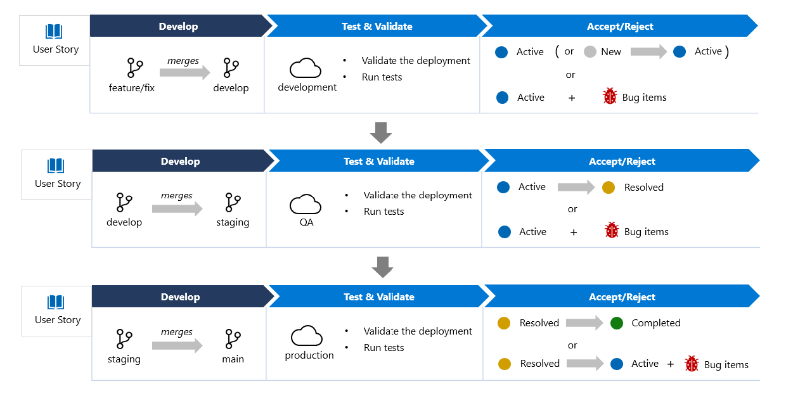
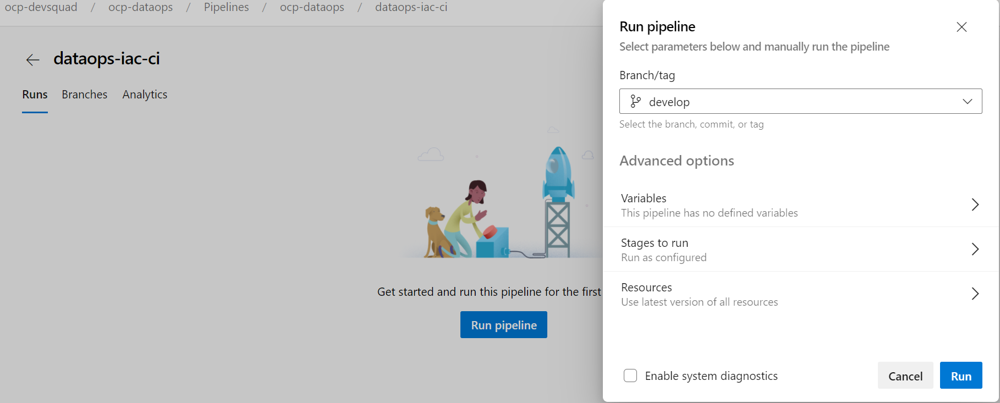
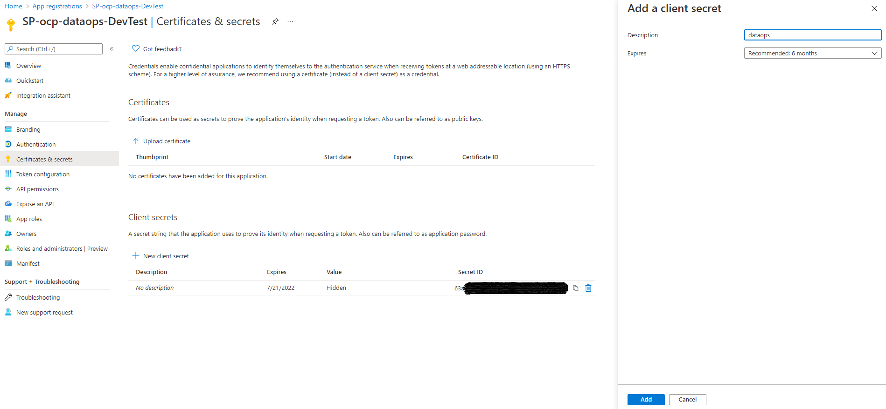

- [Exercise 3: Git Workflow and CI/CD](#Exercise-3-Git-Workflow-and-CI/CD) (45 min) (Owner: Ana/Adrian)
  - [Task 1: Understanding all folders]()

    This laboratory have a repository with different folders by component: Infraestructure as Code, Data Engineering, Azure Pipelines and others, in a real projects you will have git repositories by component.

    The structure of folders that we have is:
    ```
    <project-name>
    │
    └───azure-pipelines: CI/CD pipelines
        │
        └───adf
        │
        └───databricks
        │
        └───iac
        │      
        └───lib
    │   
    └───data-platform: Data Engineering
        │
        └───adf
        │
        └───notebooks
        │
        └───src
            │            
            └───bdd-adf-pipelines (Detail in Exercise 5)
            │            
            └───dataopslib (Detail in Exercise 4)          
    │   
    └───infrastructure-as-code: Infrastructure as Code (Detail in Exercise 2)
    │   
    └───labfiles: Step by Step guide of the Hands on Lab
    │   
    └───quickstart: Hands On Lab Before
    │   
    └───setup-data: Source of Data
    ```

    Infrastructure as code and data engineering are treated as different scopes in terms of tools, languages and patterns. For this reason, the proposal is having dedicated repositories for these workstreams. Furthermore, a repository that consolidates all technical decisions across workstreams has been considered.

    

    ## Environments

    We are working with three environments `dev`, `qa` and `prod`, and this environments are related with the branchs:

    * The `main` branch has the stable version for the **Production** environment.
    * The `qa` branch has the stable version for the **QA** environment.
    * The `develop` branch has the stable version for the **Development** environment.
    * The `feature` or `fix` branches have *preview* versions that will be reviewed by code reviewers through the Pull Request process before merging into the `develop` branch.

    <br/>

    **Setting Azure Devops Project:** before to start to execute the pipelines and execute the git workflow, it is necessary to create the environments in Azure Devops for the IaC and Databricks environments.

    


    >**Note**: Create Environments to `qa`, `prod`, `databricks-qa` and `databricks-prod` in Azure Devops before to make any Pull Request (PR).
    
    


    ## Infrastructure as code git workflow

    

    <br/>

    ## Data Engineering git workflow

    Data Engineering has two independent workflows:

    * Databricks Notebooks
    * Library

    <br/>

    ### **Databricks Notebooks**

    

    <br/>

    ### **Library**

    

    <br/>

  - [Task 2: Understanding naming conventions for branches and commits]()

    

    ### Convention of prefixes for commit messages

    * **docs:** Used for creating or updating content of documents.
    * **style:** Used for updating a style in a document (e.g. replacing a Markdown list by a table, creation of headers).
    * **feat | feature**: Used for creating a new features in the code.
    * **fix:** Used for fixing bugs on the code, as well as fixing typos or content in general on documents.
    * **test:** Used for creating new tests (e.g. unit tests, integration tests).
    * **refactor:** Used for refactoring code without introducing new features or fixing bugs.
    * **chore:** Used for modifying things that are not related to code or documentation (e.g. changing the name of a folder or directory, adding ignore files on .gitignore, deleting old files).

    <br/><br/>

  - [Task 3: Release lifecycle strategy]()

    **Predictability** is key to the success of an agile project, because it allows you to deliver business value with *frequency* and *consistency*. Predictable delivery helps build trust and is likely to lead to better results for customers and more autonomy for the team.

    The proposal is to use a **Production-first** strategy, where one of the *definition of done* requirements of a *user story* is to have all the artifacts in the **production** environment.

    

    <br/><br/>

  - [Task 4: CI/CD Pipelines]()

    Now we will start to work with the pipelines and understant the funcionality that these have.

    # CI/CD Pipeline IaC

    After completing the [Preparing your Azure DevOps project](../quickstart/docs/3a-azdo-setup-basic.md) step, make sure the CI/CD pipelines exists in Azure Devops.

    >**Note**: `dataops` word as part of the name is the alias that you assign to the project.

    

    In the quickstart the process create the pipelines to IaC, the customized library dataops, databricks and azure data factory.  Now we will see the IaC pipelines.

    

    >**Note**: `dataops` word as part of the name is the alias that you assign to the project.

    ## CI Pipeline
      
    This pipeline is the owner to create ARM template that will be used in the CD pipeline to create the resources in the differents resource groups by environment.

    ## **Run CI Pipeline**: 

    

    

    This pipeline was executed manually, but it has in the branch policies configurated to start automatically if any change occur in branch in the folder `infrastructure-as-code`:

    


    ## **Run CD Pipeline**: 

    

    When you execute the CD Pipeline of IaC you can see in the Azure Devops that you environment status will change, when this pipeline finished the execution, you can validate if you see the resources created in the resource group of development environment.

    
    

    >**Note**: Name of the Resource Groups and Resources depends of the alias and the suscription id.

    With this resources created, you can configure the scope in databricks.

    ## Databricks Secrets Scope

    When you have the resources created in the environment, it is time to configure the scope secrets in databricks, to do that, run the PowerShell script located at `infrastructure-as-code/scripts` to create the Databricks secrets scope for **each environment**:

    >**Note**: To get `$clientSecret` it is necessary to create a second client secret in the services principal (the first was used in the service connection configuration in the project in DevOps), it could be used for all environments.

    

    >**Note**: Remember copy the value because only is showen one time.

    

    Now, you should to change some parameters with your information and execute this script, and how the resources in development environment were created then we can create the scope in databricks dev.

    ```
    $clientSecret = ConvertTo-SecureString -AsPlainText

    ./DatabricksSecrets.ps1 `
      -ClientID "<client_id>" `
      -ClientSecret $clientSecret `
      -DataResourceGroup "<data_resource_group_name>" `
      -ComputeResourceGroup "<compute_resource_group_name>" `
      -KeyVaultName "<kv_name>" `
      -DataLakeName "<adls_name>" `
      -DatabricksName "<databricks_name>"
    ```
    >**Note**: To see Key names in secret scope dataops execute the follow command.

    ```
    databricks secrets list --scope dataops
    ```

    

    # CI/CD Pipeline Library

    Now, we need to create the custom library that we use in the notebooks of databricks, then we have the CI and CD Pipeline for the lib.  When these pipelines finished the execution, you could see the artifact in the feed `lib-packages` that you create in the [step 3 of the quickstart](..\quickstart\docs\3a-azdo-setup-basic.md).

    

    >**Note**: `vic` word as part of the name is the alias that you assign to the project.

    ## CI Pipeline

    Execute the CI pipeline of the library to create the version `alpha` of the library.

    

    When this pipeline finished in artifacts you can see the version.

    

    >**Note**: The number in the version is variable depends of the Build Id.

    ## CD Pipeline

    In the CD Pipeline you can to see the different stages by environment, we will to execute the CD Pipeline to left the version `beta` enable to be used in the databricks notebook.

    

    When this pipeline finished in artifacts you can see the version.

    

    >**Note**: The number in the version is variable depends of the Build Id.

    # CI/CD Pipeline Databricks

    Now you could see the pipelines that work with databricks in the aspect of the custom library and the notebooks that will be executed in databricks.

    

    ## CI Pipeline

    This pipeline make the check of the notebooks in databricks.

    

    ## CD Pipeline Lib

    This pipeline upload the current version library to the `dbfs` of databriks.

    

    You could see in the environments that the status in `databricks-dev` changed.

    

    ## CD Pipeline Notebooks

    This pipeline upload the current notebooks to the shared folder in databricks.

    

    You could see in the environments that the status in `databricks-dev` changed.

    

    # CD Pipeline ADF

    This pipeline check the integrity on the data and trigger the ADF Pipeline identifying some problems in it but this process doesnt wait that this pipeline finished.

    

    >**Note**: The first time that this pipeline is executed it fails, because it is necessary that ADF pipeline finished sucessful the first time to create some folders in the container in the datalake that are necessaries to check the integrity of the data.

    

    When the ADF Pipeline finished, you could execute again this CD Pipeline. you can check it, open ADF resource in the Azure Portal, and the in monitor the pipeline running.

    

    

    Now that you understand the workflow, you can start with the other environments.

    # Git Workflow to QA and Prod

    When the all pipelines were executed in development branch and you validate the behavior, you can start to execution of the git workflow  doing Pull Request, remember create the scope in databricks by each environment.

    Open a PR from `develop` to `qa` to promote the code changes to the QA environment. Please wait again for the creation of the QA infrastructure.

    >**Note**: It will be necessary modify branch policies to make the merge only with one reviewer and it can be the owner, click check `Allow requestors to approve their own changes` (only for the laboratory). 

    

    Repeat the process one last time, opening a PR from `qa` to `main` to promote the code changes to the PROD environment. Please wait again for the creation of the PROD infrastructure.

  <br/><br/>
    
  - [Task 5: Checklist of branching strategy (?) racionality]()

      # Code Review Checklist: Data Engineering

      ## Custom Library

      1. [ ] Does this code correctly implement the business logic?
      2. [ ] Is this code designed to be testable?
      3. [ ] Does each method or function "do one thing well"? Reviewers should recommend when methods could be split up for maintainability and testability.
      4. [ ] Are there unit tests that cover the newly added code and do they pass in the CI/CD pipelines?
      5. [ ] Do the tests for this code correctly test the code?
      6. [ ] Do unit tests mock dependencies so only the method under test is being executed?
      7. [ ] Is the code documented well?
      8. [ ] Have secrets been stripped before committing?
      9. [ ] Is PII and EUII treated correctly? In particular, make sure the code is not logging objects or strings that might contain PII (e.g. request headers).
      10. [ ] Is the deployment of the code scripted such that it is repeatable and ideally declarative?
      11. [ ] Is the PR a relatively small change? Optimal PR sizes for code reviews are typically described in terms like embodying less than three days of work or having [200 or fewer changed lines of code](https://smallbusinessprogramming.com/optimal-pull-request-size/). If not, suggest smaller user stories or more frequent PRs in the future to reduce the amount of code being reviewed in one PR.

      ## Databricks Notebooks

      1. [ ] Does the notebook correctly implement the business logic?
      2. [ ] Is each step of the notebook "doing one thing well"? Reviewers should recommend when steps could be split up for maintainability.
      3. [ ] Does the notebook leverage the custom library for data transformation?
      4. [ ] Is the notebook documented well?
      5. [ ] Have secrets been stripped before committing?
      6. [ ] Is PII and EUII treated correctly? In particular, make sure the code is not logging objects or strings that might contain PII (e.g. request headers).

      ## Additional references

      * [PEP 8: Style Guide for Python Code](https://www.python.org/dev/peps/pep-0008/)
      * [Python Best Practices Guide](https://gist.github.com/sloria/7001839)
      * [Effective code Reviews](https://www.evoketechnologies.com/blog/code-review-checklist-perform-effective-code-reviews/)
