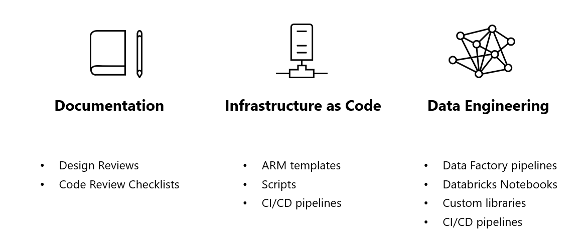
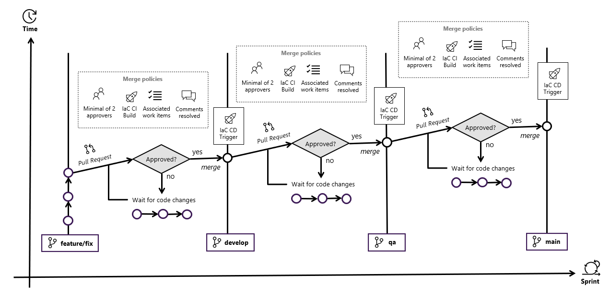
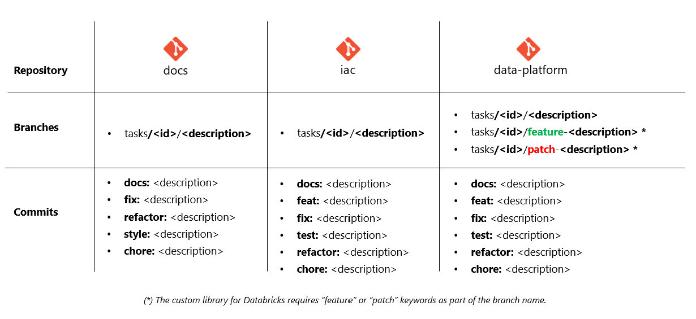

- [Exercise 3: Git Workflow and CI/CD](#Exercise-3-Git-Workflow-and-CI/CD) (45 min) (Owner: Ana/Adrian)
  - [Task 1: Understanding all folders]()

    This documentation contains the definition of the structure of folders that the laboratory has, but in a real projects you will have Git repositories for Infrastructure as Code, Data Engineering, Azure Pipelines and Documentation.

    Infrastructure as code and data engineering are treated as different scopes in terms of tools, languages and patterns. For this reason, the proposal is having dedicated repositories for these workstreams. Furthermore, a repository that consolidates all technical decisions across workstreams has been considered.

    

    In our laboratory, we have this structure of folders (Simulating Repositories):
    ```
    <project-name>
    │
    └───azure-pipelines: CI/CD pipelines
    │   
    └───data-platform: Data Engineering (Detail in Exercise 4 and 5)
    │   
    └───infrastructure-as-code: Infrastructure as Code (Detail in Exercise 2)
    │   
    └───labfiles: Step by Step guide of the Hands on Lab
    │   
    └───quickstart: Hands On Lab Before
    │   
    └───setup-data: Source of Data
    ```

    ## Environments

    We are working with three environments `dev`, `qa` and `prod`, and this environments are related with the branchs:

    * The `main` branch has the stable version for the **Production** environment.
    * The `qa` branch has the stable version for the **QA** environment.
    * The `develop` branch has the stable version for the **Development** environment.
    * The `feature` or `fix` branches have *preview* versions that will be reviewed by code reviewers through the Pull Request process before merging into the `develop` branch.

    ## Infrastructure as code git workflow

    

    <br/><br/>

    ## Data Engineering git workflow

    Data Engineering has two independent workflows:

    * Databricks Notebooks
    * Library

    ### **Databricks Notebooks**

    


    ### **Library**

    

    <br/><br/>

  - [Task 2: Understanding naming conventions for branches and commits]()

    

    ### Convention of prefixes for commit messages

    * **docs:** Used for creating or updating content of documents.
    * **style:** Used for updating a style in a document (e.g. replacing a Markdown list by a table, creation of headers).
    * **feat | feature**: Used for creating a new features in the code.
    * **fix:** Used for fixing bugs on the code, as well as fixing typos or content in general on documents.
    * **test:** Used for creating new tests (e.g. unit tests, integration tests).
    * **refactor:** Used for refactoring code without introducing new features or fixing bugs.
    * **chore:** Used for modifying things that are not related to code or documentation (e.g. changing the name of a folder or directory, adding ignore files on .gitignore, deleting old files).

    <br/><br/>

  - [Task 3: Release lifecycle strategy]()

    **Predictability** is key to the success of an agile project, because it allows you to deliver business value with *frequency* and *consistency*. Predictable delivery helps build trust and is likely to lead to better results for customers and more autonomy for the team.

    The proposal is to use a **Production-first** strategy, where one of the *definition of done* requirements of a *user story* is to have all the artifacts in the **production** environment.

    

    <br/><br/>

  - [Task 4: CI/CD Pipelines]()

      # CI/CD Pipeline IaC
      ```
      <project-name>
      │
      └───<alias>-iac-ci
      │
      └───<alias>-iac-cd
      ```

      ## `alias`-iac-ci
      
      This pipeline is the owner to create ARM template that will be used in the CD pipeline to create the resources in the differents resource groups.

      ```
      stages:
      - stage: validate
        displayName: 'Validate'
        jobs:
        - job: lint
          displayName: 'Lint'
          pool:
            vmImage: 'Ubuntu-20.04'
          steps:
          - template: step.install-arm-template-toolkit.yml
            parameters:
              ttkFolder: ./ttk
          - task: PowerShell@2
            displayName: Run ARM Template Test Tookit
            inputs:
              pwsh: true
              targetType: 'filePath'
              filePath: infrastructure-as-code/scripts/Lint.ps1
              arguments: >
                -TtkFolder "./ttk"
      ```

      This pipeline has a build policy in the branchs:

      

      If we have any change in the folder `infrastructure-as-code` folder, the pipeline start automatically.

      ### `<alias>-iac-cd`


      # CI/CD Pipeline Library
      # CI/CD Pipeline Databricks
      # CI/CD Pipeline ADF


  <br/><br/>
    
  - [Task 5: Checklist of branching strategy (?) racionality]()

      # Code Review Checklist: Data Engineering

      ## Custom Library

      1. [ ] Does this code correctly implement the business logic?
      2. [ ] Is this code designed to be testable?
      3. [ ] Does each method or function "do one thing well"? Reviewers should recommend when methods could be split up for maintainability and testability.
      4. [ ] Are there unit tests that cover the newly added code and do they pass in the CI/CD pipelines?
      5. [ ] Do the tests for this code correctly test the code?
      6. [ ] Do unit tests mock dependencies so only the method under test is being executed?
      7. [ ] Is the code documented well?
      8. [ ] Have secrets been stripped before committing?
      9. [ ] Is PII and EUII treated correctly? In particular, make sure the code is not logging objects or strings that might contain PII (e.g. request headers).
      10. [ ] Is the deployment of the code scripted such that it is repeatable and ideally declarative?
      11. [ ] Is the PR a relatively small change? Optimal PR sizes for code reviews are typically described in terms like embodying less than three days of work or having [200 or fewer changed lines of code](https://smallbusinessprogramming.com/optimal-pull-request-size/). If not, suggest smaller user stories or more frequent PRs in the future to reduce the amount of code being reviewed in one PR.

      ## Databricks Notebooks

      1. [ ] Does the notebook correctly implement the business logic?
      2. [ ] Is each step of the notebook "doing one thing well"? Reviewers should recommend when steps could be split up for maintainability.
      3. [ ] Does the notebook leverage the custom library for data transformation?
      4. [ ] Is the notebook documented well?
      5. [ ] Have secrets been stripped before committing?
      6. [ ] Is PII and EUII treated correctly? In particular, make sure the code is not logging objects or strings that might contain PII (e.g. request headers).

      ## Additional references

      * [PEP 8: Style Guide for Python Code](https://www.python.org/dev/peps/pep-0008/)
      * [Python Best Practices Guide](https://gist.github.com/sloria/7001839)
      * [Effective code Reviews](https://www.evoketechnologies.com/blog/code-review-checklist-perform-effective-code-reviews/)
