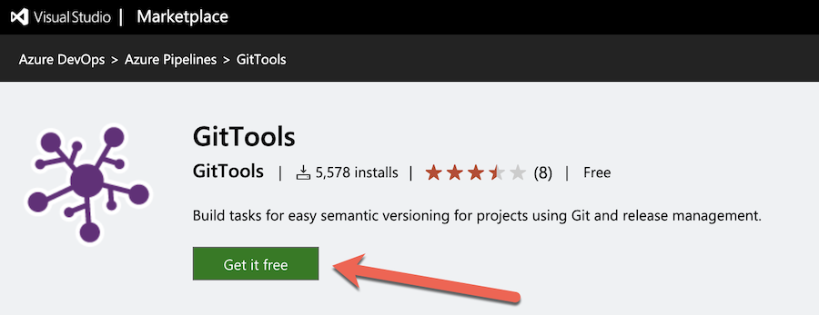
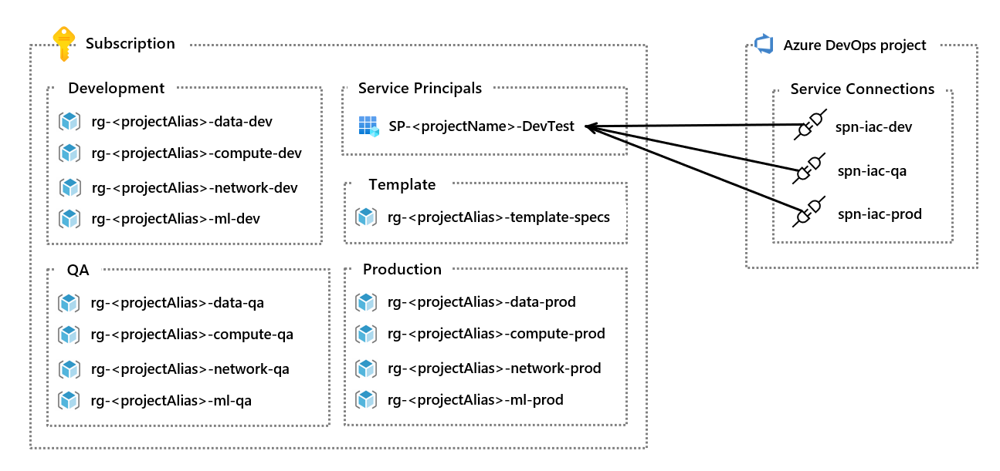
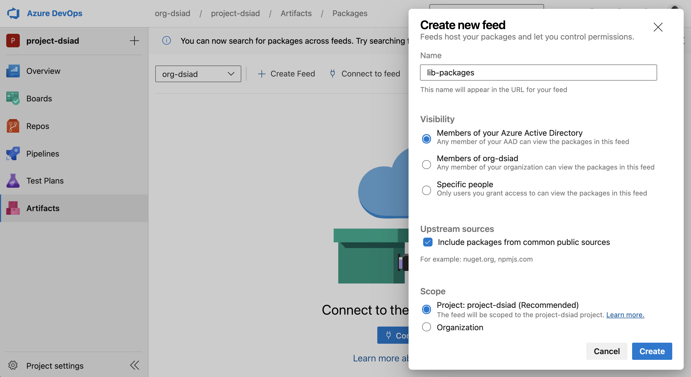
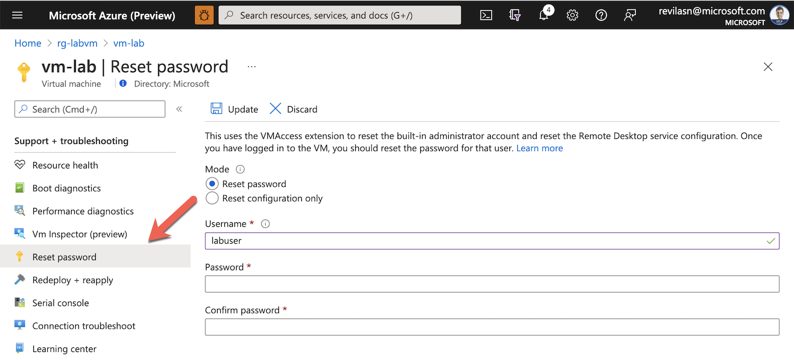

# Setup the Hands-On Lab

Execute all these steps below to setup your evironment before running the Hands-On Lab.

## Step 1: Azure DevOps Setup

1. Create a new [Azure Azure DevOps Project](https://docs.microsoft.com/en-us/azure/devops/organizations/projects/create-project?view=azure-devops&tabs=preview-page).

    - **Visibility:** `Private`

    - **Work item process:** `Agile`

    

2. [Install the GitTools extension](https://marketplace.visualstudio.com/items?itemName=gittools.gittools&targetId=0d8e54d4-e229-47bd-9dc5-9be0f116a5c0&utm_source=vstsproduct&utm_medium=ExtHubManageList) in the Organization level of the new Azure DevOps project.

    

3. Authorize the project **Build Service** to be an Administrator of Variable Groups:

    - Select **Library** under **Pipelines**:

        

    - Click the **Security** button:

        

    - Make sure the **Build Service** has the **Administrator** role:

        

        > In case the Build Service user is not present on this list, click on `+ Add` and search for `<projectName> Build Service`, assigning the `Administrator` role.

4. Make sure the Organization where the project is created in the Azure DevOps is [connected with the Azure Active Directory](https://docs.microsoft.com/en-us/azure/devops/organizations/accounts/connect-organization-to-azure-ad?view=azure-devops) of the Azure Subscription that will be used in the lab.


## Step 2: Setup the Hands-On Lab configuration file

1. Open the [Azure Cloud Shell](https://shell.azure.com) and select the **PowerShell** option.

    > When using the Azure Cloud Shell, be sure you are logged in Azure with the subscription you want to use for the hands-on lab.

2. **On the Azure PowerShell terminal:** clone the source code of the lab and go to the `hol` directory.

    ```powershell
    git clone https://github.com/microsoft/devsquad-in-a-day.git
    
    cd devsquad-in-a-day
    ```

3. **On the Azure PowerShell terminal**: execute the following command to create a new config file based on an existing template. Provide arguments to this setup based on the table below:

    ```powershell
    # Be sure to execute this script under the hol directory
    ./quickstart/scripts/cloud-setup/Replace-TemplateArgs.ps1
    ```

    |Argument|Description|Example|
    |-----|-----------|-------|
    |<_orgName_>|Azure DevOps organization name where you will execute the Hands-On Lab|_org-dataops_|
    |<_projectName_>|Name of the existing project inside Azure DevOps where you will execute the Hands-On Lab|_project-dataops_|
    |<_projectAlias_>|An unique string with less than 8 characteres that will be used as part of your resource group names|_dataops_|
    |<_subscriptionId_>|Azure Subscription ID where the resources will be deployed|_f7e5bb9e-0f98-4c5d-a5c1-a9154bf3cd61_|

- (_OPTIONAL_) If you are using this project as a Hands-On Lab, feel free to proceed to the next step of the lab setup. If you are using this project as a template for dataops, check [this additional documentation](./1b-create-prereqs-azure-advanced.md) that explains advanced configuration options.


## Step 3: Deploy Azure Resources in your subscription

1. Generate a Personal Access Token (PAT) on Azure DevOps.

    - An environment variable called `AZURE_DEVOPS_EXT_PAT` that stores a [PAT (Personal Access Token)](https://docs.microsoft.com/en-us/azure/devops/organizations/accounts/use-personal-access-tokens-to-authenticate?view=azure-devops&tabs=preview-page) with **Full Access** is required to allow the next script to connect to the new Azure DevOps project and deploy all the resources.

    - To do so, create the PAT on your new Azure DevOps project then run the following command **on the Azure PowerShell terminal**:

        ```powershell
        $env:AZURE_DEVOPS_EXT_PAT="<my PAT goes here>"
        ```

2. Connect and authenticate to your Azure account.

    - **On the Azure PowerShell terminal**: connect to Azure with your authenticated account.

        ```powershell
        Connect-AzAccount -UseDeviceAuthentication
        ```

3. Run the deployment script

    -  **On the Azure PowerShell terminal**: run the `Deploy-AzurePreReqs.ps1` script to deploy the pre-required Azure resources:

        ```powershell
        ./quickstart/scripts/cloud-setup/Deploy-AzurePreReqs.ps1 -ConfigurationFile "quickstart/configs/cloud-setup/hol.json"
        ```

    - The diagram below shows what Azure resources will be created after the execution of the script.

        

## Step 4: Prepare your Azure DevOps project

1. Create an Artifact Feed

    -  An artifact feed is required on the lab for publishing Python libraries with versioning.
    
    - On your Azure DevOps project, go to the `Artifacts` section -> `Create Feed`, then set the name as `lib-packages`:

        

2. Azure DevOps project setup

    - **On the Azure PowerShell terminal**: run the command below.

        ```powershell
        # You don't need to change any of the following values below
        git config --global user.email "hol@microsoft.com"
        git config --global user.name "HOL Setup User"
        $env:AZURE_DEVOPS_EXT_PAT_TEMPLATE="2je7narfoc2rusvewdjpfnlcn3pyponyrpsko3w5b6z26zj4wpoa"
        ```

        > This command configures git and defines an environment variable that will be used to setup your Azure DevOps project.

    - **On the Azure PowerShell terminal**: run the following script to clone the `hol` repo, create the pipelines and service connections inside your new Azure DevOps.

        ```powershell
        ./quickstart/scripts/dataops/Deploy-AzureDevOps.ps1 -ConfigurationFile "./quickstart/outputs/hol.json" -UsePAT $true
        ```

        >  Note the file name is the one inside the output directory and the name is the same name of the _projectName_ that was replaced in the first config file.


3. (Optional) If you are using this project as a Hands-On Lab, feel free to proceed to the next step of the lab setup. If you are using this project as a template for dataops, check [this documentation](./3b-azdo-setup-advanced.md) for understanding more details about the `AZURE_DEVOPS_EXT_PAT_TEMPLATE` environment variable.


## Step 5: Create the Hands-On Lab VM

1. Deploy a pre-configured VM that contains all the tools required for executing the Hands-On Lab.

    - **On the Azure PowerShell terminal**: run `Deploy-LabVM.ps1`.
    
        ```powershell
        ./quickstart/scripts/labvm/Deploy-LabVM.ps1
        ```


2. Access the VM resource and assign a new password to the user `labuser`.
    
    

    - Feel free to create any password of your preference, or to use the suggestion below:

        - **Username:** `labuser`

        - **Password:** `Password.1!!`

3. Connect to the VM using a RDP client:

    

    > Note that the RDP port of the VM is already configured to allow inbound access.


You should follow all these steps provided *before* starting the Hands-on lab.
