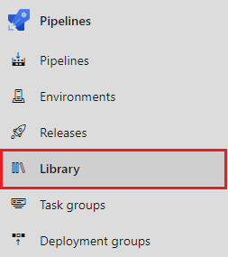

# Before Hands-On Lab Quickstart

## Pre-requisites

1. Create a new [Azure Azure DevOps Project](https://docs.microsoft.com/en-us/azure/devops/organizations/projects/create-project?view=azure-devops&tabs=preview-page).

2. [Install](https://docs.microsoft.com/en-us/azure/devops/marketplace/install-extension?view=azure-devops&tabs=browser) the [GitTools extension](https://marketplace.visualstudio.com/items?itemName=gittools.gittools&targetId=0d8e54d4-e229-47bd-9dc5-9be0f116a5c0&utm_source=vstsproduct&utm_medium=ExtHubManageList) in the Organization level of the new Azure DevOps Project

3. Authorize the project **Build Service** to be an Administrator of Variable Groups:

    - Select **Library** under **Pipelines**:

        

    - Click the **Security** button:

        

    - Make sure the **Build Service** has the **Administrator** role:

        

        > In case the Build Service user is not present on this list, click on `+ Add` and search for `projectName Build Service`, assigning the `Administrator` role.

4. Make sure the Organization where the project is created in the Azure DevOps is [connected with the Azure Active Directory](https://docs.microsoft.com/en-us/azure/devops/organizations/accounts/connect-organization-to-azure-ad?view=azure-devops
) of the Azure Subscription that will be used in the lab.

## Setup the Configuration File

1. Open the terminal and create a new config file based on the template:

    ```
    cp quickstart/configs/cloud-setup/template.json quickstart/configs/cloud-setup/hol.json
    ```

2. Open the file `quickstart/configs/cloud-setup/hol.json` using your favorite editor and replace the following values:

    |Value|Description|Example|
    |-----|-----------|-------|
    |<_projectName_>|Name of the existing project inside Azure DevOps that will be used in the lab|_MyDataOpsHOL_|
    |<_projectAlias_>|A string of 8 characteres that will be used as part of the name of for the Resource Groups|_dataops_|
    |<_orgName_>|Azure DevOps organization name|_MyOrg_|
    |<_subscriptionId_>|Azure Subscription ID where the resources will be deployed|_f7e5bb9e-0f98-4c5d-a5c1-a9154bf3cd61_|

## Run the Scripts

Using [PowerShell Core](https://docs.microsoft.com/en-us/powershell/scripting/install/installing-powershell?view=powershell-7.1), run the following commands:

3. Run the script to deploy the Azure pre-requisites. Note that this script will also validade the parameters of the config file.

    ```
    az login

    Connect-AzAccount

    ./quickstart/scripts/cloud-setup/Deploy-AzurePreReqs.ps1 -ConfigurationFile "quickstart/configs/cloud-setup/hol.json"
    ```

4. Set the environment variable ```$env:AZURE_DEVOPS_EXT_PAT_TEMPLATE``` with a [PAT (Personal Access Token)](https://docs.microsoft.com/en-us/azure/devops/organizations/accounts/use-personal-access-tokens-to-authenticate?view=azure-devops&tabs=preview-page) with **Code (read)** [scope](https://docs.microsoft.com/en-us/azure/devops/integrate/get-started/authentication/oauth?view=azure-devops#scopes) to enable the script to connect to the Azure DevOps containing the files and instructions of the lab. It is required because if will clone the repository to the new Azure DevOps project that will be used for this lab.

  ```
  $env:AZURE_DEVOPS_EXT_PAT_TEMPLATE="<my pat goes here>"
  ```

4. Set the environment variable `$env:AZURE_DEVOPS_EXT_PAT` with a [PAT (Personal Access Token)](https://docs.microsoft.com/en-us/azure/devops/organizations/accounts/use-personal-access-tokens-to-authenticate?view=azure-devops&tabs=preview-page) with **Full Access** to enable the script to connect to the new Azure DevOps to deploy all the resources.

  ```
  $env:AZURE_DEVOPS_EXT_PAT="<my pat goes here>"
  ```

5. Run the script to clone the repo, create the pipeline and service connections inside the new Azure DevOps.

>  Note the file name is the one inside the output directory and the name is the same name of the _projectName_ that was replaced in the first config file.

  ```
  ./quickstart/scripts/dataops/Deploy-AzureDevOps.ps1 -ConfigurationFile "./quickstart/outputs/hol.json"
  ```
