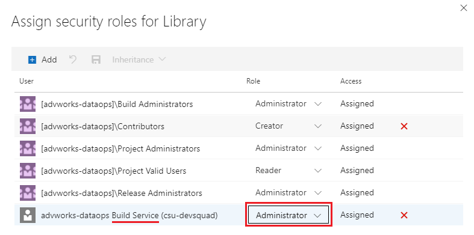

# Hands-On Lab: Prerequisites

## Azure DevOps project

1. Create a new [Azure Azure DevOps Project](https://docs.microsoft.com/en-us/azure/devops/organizations/projects/create-project?view=azure-devops&tabs=preview-page).

2. [Install](https://docs.microsoft.com/en-us/azure/devops/marketplace/install-extension?view=azure-devops&tabs=browser) the [GitTools extension](https://marketplace.visualstudio.com/items?itemName=gittools.gittools&targetId=0d8e54d4-e229-47bd-9dc5-9be0f116a5c0&utm_source=vstsproduct&utm_medium=ExtHubManageList) in the Organization level of the new Azure DevOps Project

3. Authorize the project **Build Service** to be an Administrator of Variable Groups:

    - Select **Library** under **Pipelines**:

        

    - Click the **Security** button:

        

    - Make sure the **Build Service** has the **Administrator** role:

        

        > In case the Build Service user is not present on this list, click on `+ Add` and search for `projectName Build Service`, assigning the `Administrator` role.

4. Make sure the Organization where the project is created in the Azure DevOps is [connected with the Azure Active Directory](https://docs.microsoft.com/en-us/azure/devops/organizations/accounts/connect-organization-to-azure-ad?view=azure-devops
) of the Azure Subscription that will be used in the lab.

## PowerShell

1. The lab requires **PowerShell 7.1** with [PowerShell Core](https://docs.microsoft.com/en-us/powershell/module/microsoft.powershell.core/?view=powershell-7.1) module, which can be installed either on Windows or Linux.

  - If you have a preference to run PowerShell on Windows, follow the [Installing PowerShell on Windows](https://docs.microsoft.com/en-us/powershell/scripting/install/installing-powershell-core-on-windows?view=powershell-7.1) instructions.
  - Otherwise, follow the [Installing PowerShell on Linux](https://docs.microsoft.com/en-us/powershell/scripting/install/installing-powershell-core-on-linux?view=powershell-7.1) instructions.

  > If you installed PowerShell on Linux, make sure to start it by running the `pwsh` command on your terminal.

2. Install the [Azure Az PowerShell module](https://docs.microsoft.com/en-us/powershell/azure/install-az-ps?view=azps-6.2.0).

## Azure CLI

1. Install the [Azure CLI](https://docs.microsoft.com/en-us/cli/azure/install-azure-cli).

2. Install the [Azure DevOps CLI](https://docs.microsoft.com/en-us/azure/devops/cli/?view=azure-devops).

## Other Tools

1. Install the [Databricks CLI](https://docs.microsoft.com/en-us/azure/databricks/dev-tools/cli/#install-the-cli).