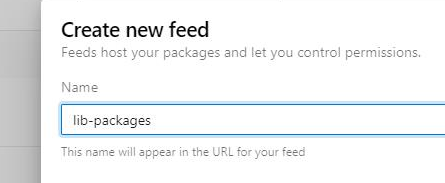

# Prepare your Azure DevOps project

## Create an Artifact Feed

An artifact feed is required on the lab for publishing Python libraries with versioning.
On your Azure DevOps project, go to the `Artifacts` section -> `Create Feed`, then set the name as `lib-packages`:



## Create the environment variables

An environment variable called `AZURE_DEVOPS_EXT_PAT_TEMPLATE` that stores a [PAT (Personal Access Token)](https://docs.microsoft.com/en-us/azure/devops/organizations/accounts/use-personal-access-tokens-to-authenticate?view=azure-devops&tabs=preview-page) with **Code (read)** [scope](https://docs.microsoft.com/en-us/azure/devops/integrate/get-started/authentication/oauth?view=azure-devops#scopes) is required to allow you to clone this repository to your new Azure DevOps project that will be used for this lab.

To do so, create a PAT on the `advworks-dataops` project (not on your new Azure DevOps project) then run the following command:

```
$env:AZURE_DEVOPS_EXT_PAT_TEMPLATE="<my pat goes here>"
```

## Project setup

Run the following script to clone the `hol` repo, create the pipelines and service connections inside your new Azure DevOps.

>  Note the file name is the one inside the output directory and the name is the same name of the _projectName_ that was replaced in the first config file.

```
./quickstart/scripts/dataops/Deploy-AzureDevOps.ps1 -ConfigurationFile "./quickstart/outputs/hol.json" -UsePAT $true
```

## Next Step

* [Create Azure Databricks secrets scope for all environments](./4-create-databricks-secrets-scope.md)
